

  

# Hire Desk System — AV Equipment Rental

**A complete hire desk operations system built without writing a single line of code — bookings, real-time tracking, and automated overdue detection all working together.**

[View Live Dashboard →](https://6hvdk3x1c2.zite.so)

---

## The problem

An AV equipment rental business was managing bookings manually. No central system. No real-time visibility into what equipment was out or overdue. Staff were tracking everything by hand, chasing returns reactively, and had no single place to see the status of all active bookings.

---

## What I built

Three parts working together:

| Layer | Tool | Purpose |
|---|---|---|
| Booking form | Fillout | Customer-facing multi-step form with conditional logic |
| Database | Zite Database | Three-table relational model: Customers, Equipment, Bookings |
| Staff dashboard | Zite Apps | Real-time internal view with status cards and filters |
| Automation | Make.com | Scheduled daily workflow for overdue detection |
| Notifications | Gmail | Automated email alerts for overdue bookings |

---

## The result

Bookings flow from customer submission directly into the staff dashboard. Staff arrive each morning with an up-to-date view of all active equipment and an email summary of anything overdue — without touching a spreadsheet or chasing anything manually. Overdue returns are caught and flagged automatically, every day, without human intervention.

---

## Staff dashboard

A real-time internal view showing all bookings grouped by status — Waiting, Confirmed, Out, Overdue, Returned — with individual booking detail views including equipment, quantities, daily rates, and totals.

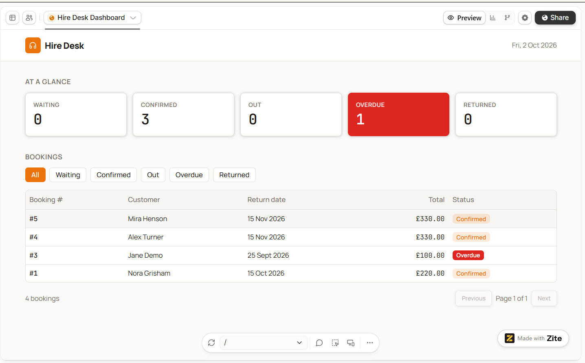

---

## Individual booking view

Each booking record shows the full detail — customer, equipment lines, quantities, days hired, daily rates, return date, and running total. Staff can update status directly from this view.

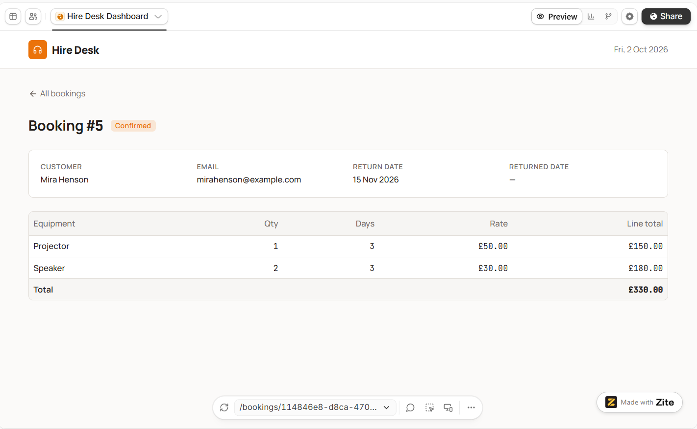

---

## Automated overdue detection

A Make.com scenario runs every morning at 08:00. It queries all bookings where the return date has passed and no returned date has been logged — patches each record's status to Overdue automatically — then sends an email alert to staff for every flagged item. No manual checking required.

| Step | Action |
|---|---|
| Trigger | Scheduled daily at 08:00 |
| HTTP 1 | POST to Zite REST API — query bookings where Return Date is past and Returned Date is empty |
| Iterator | Loop through each matching booking record |
| HTTP 2 | PATCH each record's Status field to "Overdue" |
| Gmail | Send email alert with booking details for each overdue item |

> Verified execution: Oct 2 2026, 8:00:35 AM — Status: Success, Duration: 4 seconds.

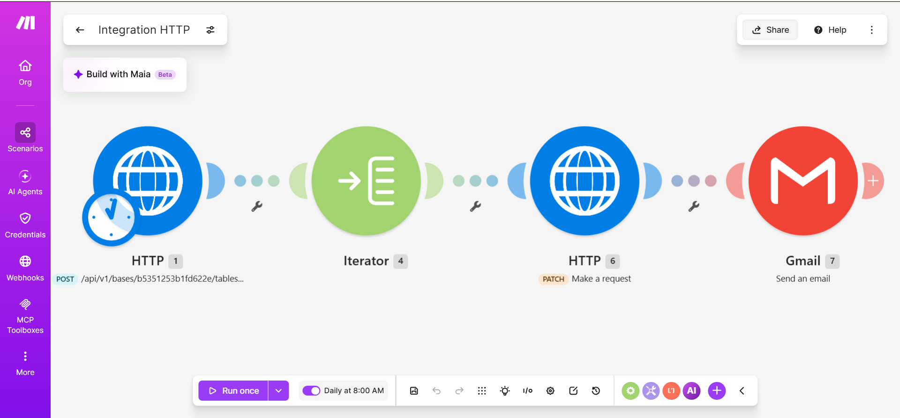
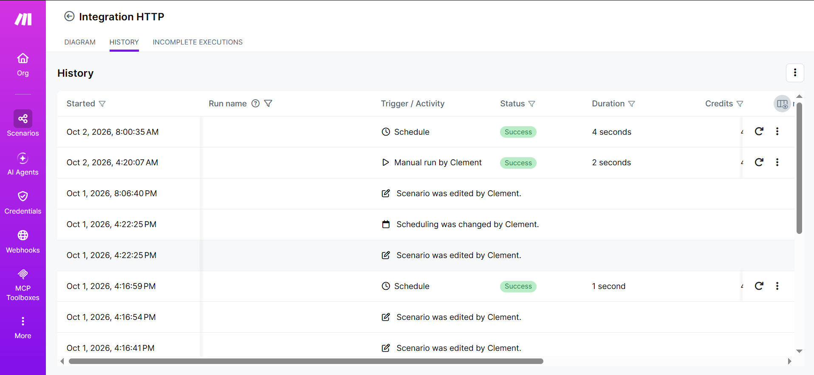

---

## Customer booking form

A multi-step form with conditional logic — new vs existing customer paths, equipment selection linked to live database pricing, and an automatic confirmation on submission.

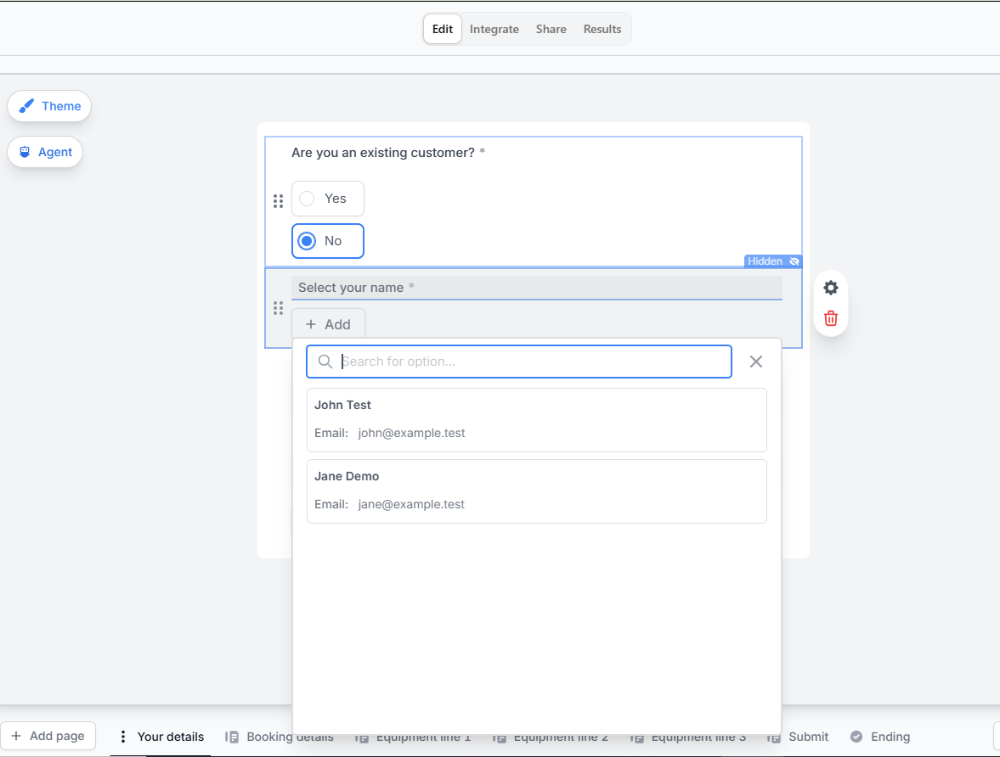
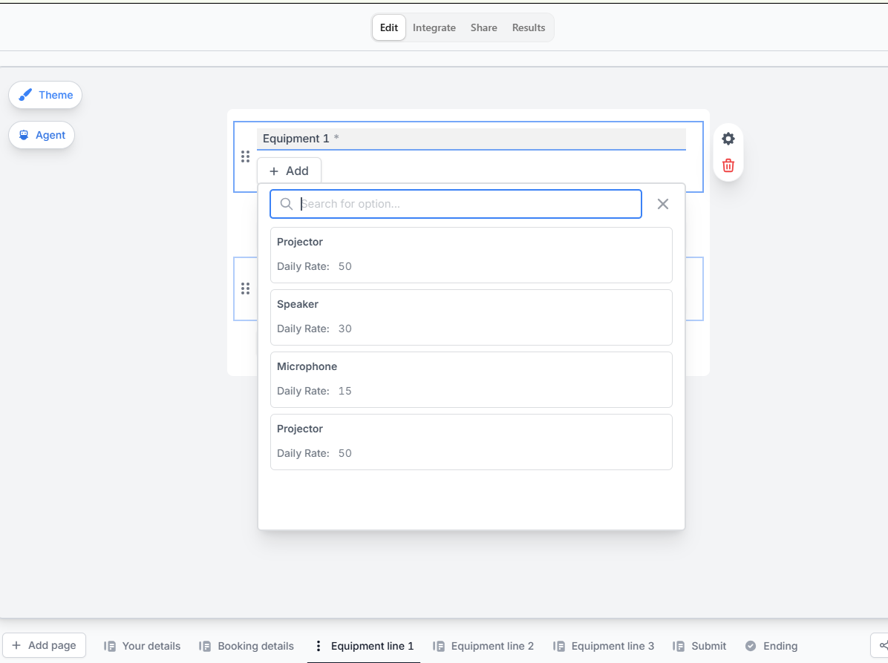
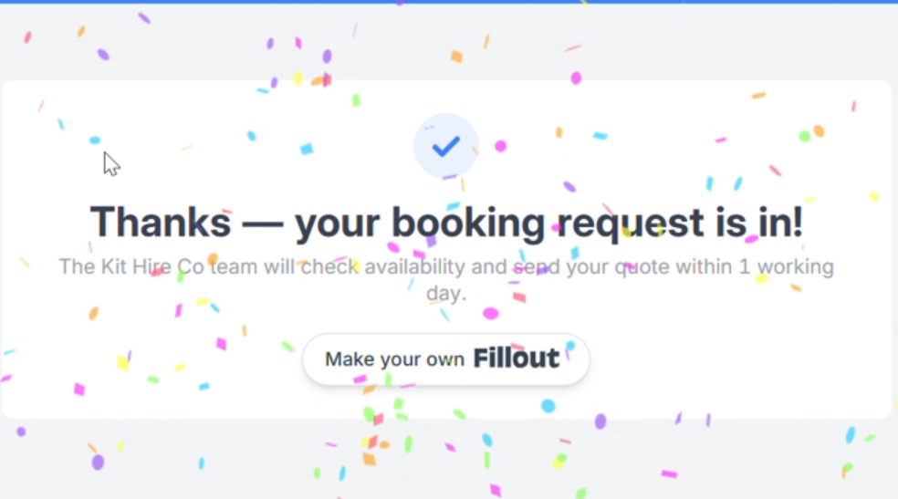
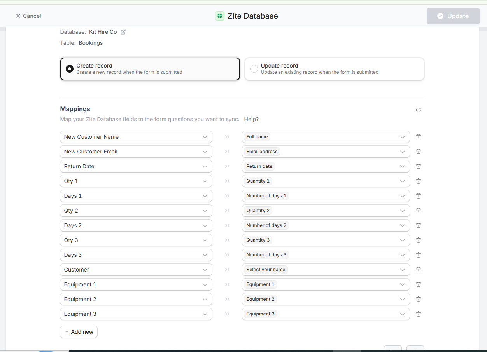

---

## Database

Three relational tables powering the entire system.

**Bookings** — booking number, customer, equipment (up to 3 lines), quantities, days, return date, returned date, total, status

**Customers** — name, email, linked bookings

**Equipment** — item name, daily rate, linked bookings

### Booking lifecycle

`Waiting` → `Confirmed` → `Out` → `Overdue` *(auto-detected)* → `Returned`

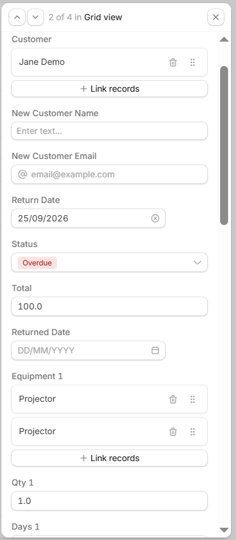
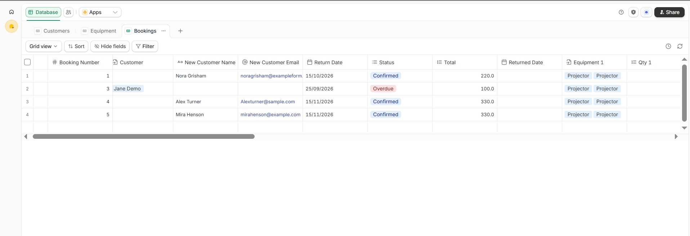
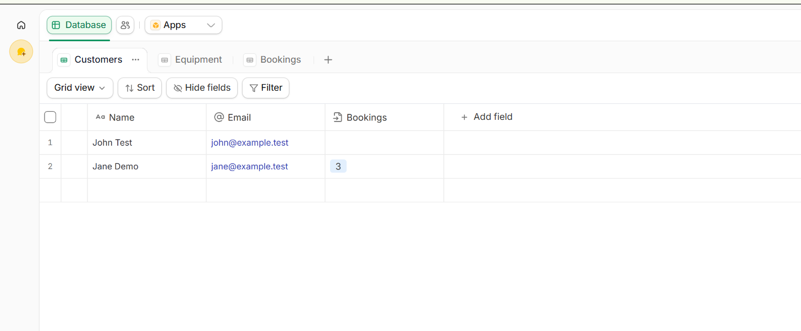
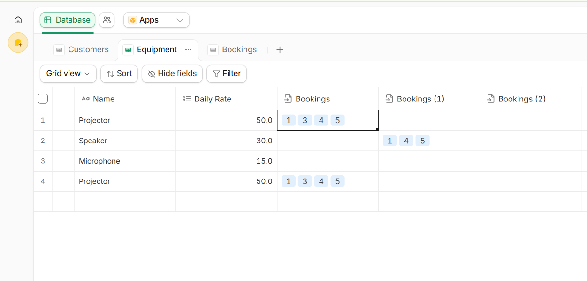

---

## Stack

`Zite` &nbsp; `Fillout` &nbsp; `Make.com` &nbsp; `Gmail`

---

Built by **C Okeniyi** · Operations & Automation

